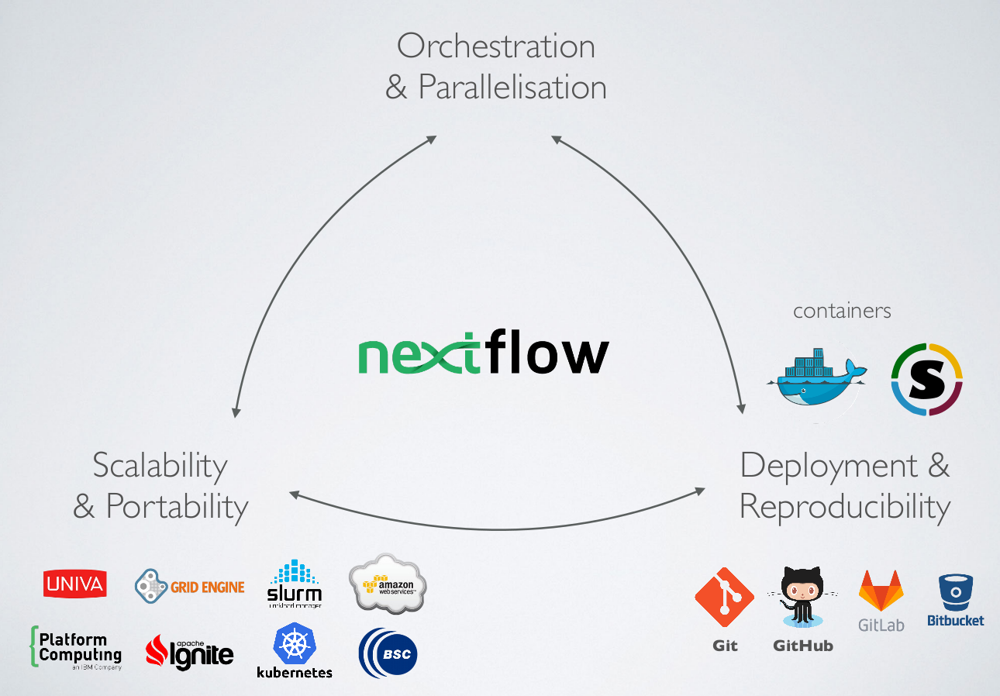

```{r setup, include=FALSE}
knitr::opts_chunk$set(cache=TRUE)
```


<div class="column-left">


<!-- <blockquote class="twitter-tweet" data-lang="en"><p lang="en" dir="ltr">Nextflow&#39;s DAG of this pipeline is slightly more complicated... <a href="https://t.co/B7HVkCRifp">pic.twitter.com/B7HVkCRifp</a></p>&mdash; Diogo Silva (@ODiogoSilva) <a href="https://twitter.com/ODiogoSilva/status/987386007485075461?ref_src=twsrc%5Etfw">April 20, 2018</a></blockquote>
<script async src="https://platform.twitter.com/widgets.js" charset="utf-8">

</script> -->

</div>

<div class="column-right" style="center">

## The challenge

### Large analysis workflows are fragile ecosystems of software tools, scripts and dependencies.

### This complexity commonly makes these workflows not only irreproducible but sometimes even not re-runnable outside their original development environment.

</div>


----

<div class="column-left">

[{ width=80% }](https://xkcd.com/242/)

<small> [https://xkcd.com/242/](https://xkcd.com/242/) </small>
</div>

<div class="column-right" style="center">


### Let others and your future self(!)

* reliably re-run your analyses
* trace back origins of results

### Re-running pipelines

* new data (e.g. additional samples)
* updated software
* different compute environment (cloud?)
* errors found
* new ideas

</div>


----

## Workflows wish-list

* version controlled
* sharable
* container-backed
* seamless execution across different environments
    * laptop (if computationally feasible)
    * server
    * cluster
    * cloud

<div class="column-right">
<!--{width=33%}-->
{width=33%}
</div>

----

### Choosing a workflow system

* [~~214~~ 239 systems and counting](https://s.apache.org/existing-workflow-systems)
  * from `make` to Galaxy
  * see also [this list](https://github.com/pditommaso/awesome-pipeline)
* Considerations
  * active development?
  * (community) support?
  * flexibility and ease of development
  * learning curve
  * abstraction level


<!-- ----

### Non-GUI, bioinformatics-flavoured and actively developed

* Nextflow
  * dataflow programming model
  * conditional paths which may depend on intermediate results
  * DAG not known in advance

* Snakemake: *a pythonic workflow system* - covered in last [EMBL-ABR webinar](https://github.com/UofABioinformaticsHub/2019_EMBL-ABR_Snakemake_webinar)
  * follows `make` philosophy
  * rules and patterns that depend on input/output file names
  * explicit, precomputed DAG

* Comparisons
  * 2018 [https://vatlab.github.io/blog/post/comparison/](https://vatlab.github.io/blog/post/comparison/) (by SoS authors)
  * 2017 [https://www.nature.com/articles/nbt.3820/tables/1](https://www.nature.com/articles/nbt.3820/tables/1) (by NF authors)
  * 2016 [https://jmazz.me/blog/NGS-Workflows](https://jmazz.me/blog/NGS-Workflows) (blog)
  * 2016 [https://doi.org/10.1093/bib/bbw020](https://doi.org/10.1093/bib/bbw020) (review, not quite right about NF) -->

----


{width=80%}


----


## [Nextflow](https://www.nextflow.io/)

* A reactive workflow framework and a domain specific programming language.
* Implicitly parallelized, asynchronous data streams
* Separation of pipeline logic from layers defining
  * software environment (on `$PATH`, modules, binaries, conda, containers)
  * execution environment (laptop, server, HPC cluster, cloud)
* Integration with git hosting services


### Designed for

  * specific use case: seamless scalability of existing tools and scripts
  * for bioinformaticians familiar with programming

---

## [Nextflow](https://www.nextflow.io/)

### Features

* Separation of pipeline logic from compute environment definition(s)
* Syntax is a superset of Groovy, but **polyglot** - easily mix scripting languages
* Out-of-the-box support for
  * SGE, LSF, **SLURM**, PBS/Torque, NQSII HTCondor, Ignite, Kubernets, Amazon Cloud, AWS Batch, Google Cloud

* Support for Conda/[Bioconda](https://bioconda.github.io/)

<small>
[https://www.nature.com/articles/nbt.3820/](https://www.nature.com/articles/nbt.3820)
</small>


----

## Nextflow building blocks

### *Processes* (tasks)

  * safe and lock-free parallelization
  * executed in separate work directories
  * easy clean-up, no issue of partial results following an error


### *Channels*

  * facilitate data flow between processes by linking their outputs/inputs
  * a suite of [operators](https://www.nextflow.io/docs/latest/operator.html) applied to channels to shape the data flow
    * filtering
    * transforming
    * forking
    * combining
    * ...and more

----


## Getting started

### Required

* POSIX compatible system (Linux, Solaris, OS X, etc)
* Bash 2.3 (or later)
* Java 8  (or later)

### Install

```
curl -s https://get.nextflow.io | bash
```

### Software you want to run

* Available on PATH or under `bin/`
* via Docker
* via Singularity
* via Conda
* via Modules

----

## Hello world syntax

```{bash, comment='', echo = FALSE}
curl -sL  https://raw.githubusercontent.com/nextflow-io/hello/master/main.nf
```


----

## Hello world run


```{bash, comment=''}
nextflow run hello
```

```{bash, comment=''}
nextflow info hello
```

----

## [Hello  ~~world~~ shared pipelines](https://www.nextflow.io/blog/2014/share-nextflow-pipelines-with-github.html)

* Run specific revision (tag/branch/commit SHA hash)

```{bash, eval=FALSE}
nextflow run hello -r v1.1
```

```{bash, eval=FALSE}
nextflow run hello -r mybranch
```

```{bash, comment=''}
nextflow run hello -r 451ebd9
```

----

## Command line syntax basics

* Single dash for Nextflow params
```{bash, eval=FALSE}
nextflow run main.nf -with-dag mydag.png -with-docker
```

* Double dash for pipeline params (defined by you)
```{bash, eval=FALSE}
nextflow run main.nf --input sample.fastq.gz
```

* Many params can also be set via [environmental variables](https://www.nextflow.io/docs/latest/config.html#environment-variables)
```{bash, eval=FALSE}
NXF_VER=19.01.0 nextflow run main.nf
```

* Resuming - note the single dash(!)
```{bash, eval=FALSE}
nextflow run main.nf -resume
```

----

## [Example workflow](https://github.com/csiro-crop-informatics/nextflow-embl-abr-webinar)


```{bash, echo = FALSE}
dot -Tpng -Gsize=9,7\! -Gdpi=100 -ofigs/flowchart_small.png flowinfo/flowchart.dot
```

<div class="column-left">
* Workflow logic is adapted from the recent EMBL-ABR [Snakemake webinar](https://github.com/UofABioinformaticsHub/2019_EMBL-ABR_Snakemake_webinar)
* Credit: Nathan Watson-Haigh
</div>

<div class="column-right">

</div>


----

## [Example workflow](https://github.com/csiro-crop-informatics/nextflow-embl-abr-webinar)


```{bash, comment=''}
nextflow run ../main.nf -profile docker -resume
```


----

## [Example workflow](https://github.com/csiro-crop-informatics/nextflow-embl-abr-webinar)

<script id="asciicast-233197" src="https://asciinema.org/a/233197.js" async data-speed="1.5" data-theme="tango" data-autoplay="false" data-loop="true" data-size="medium">
</script>

<!-- data-cols="200" data-rows="50"  -->


----

## The work directory (1/2)

```{bash, comment=''}
tree -L 2 work
```

<!-- <div class="column-left">

</div>

<div class="column-right"> -->


<!-- ```{bash, comment=''}
rm -rf work
nextflow run blast-example -with-docker -with-dag figs/blast.png \
&& tree -L 2 work
``` -->
<!--
</div> -->

----

## The work directory (2/2)


```{bash, comment='', cache=FALSE}
tree -ah work
```

----

## [Configuration file(s)](https://www.nextflow.io/docs/latest/config.html)

* `nextflow.config`
* `$HOME/.nextflow/config`
* But also
  * Include multiple config files via [`includeConfig another.config`](https://www.nextflow.io/docs/latest/config.html#config-include)
  * Extend config by passing additional file at run time `-c additional.config`
  * Ignore default and use custom config file passed at run time `-C custom.config`

* [Config scopes](https://www.nextflow.io/docs/latest/config.html#config-scopes) e.g. `env`, `params`, `process`, `docker`...
* [Config profiles](https://www.nextflow.io/docs/latest/config.html#config-profiles)

----

### Recall: separation of workflow logic from compute, software envs

* Much about software, execution environments _can_ be defined in the *directive* declarations block at the top of the process body e.g.

```{bash, comment='', , eval=FALSE}
process extract_reads {
  executor 'slurm'
  module 'samtools/1.9'
  ...
```

* Usually preferred to define these in [`nextflow.config`](https://github.com/csiro-crop-informatics/nextflow-embl-abr-webinar/blob/master/nextflow.config) *et al.*

```{bash, comment='', cache=FALSE, echo=FALSE}
curl -sL https://raw.githubusercontent.com/csiro-crop-informatics/nextflow-embl-abr-webinar/master/nextflow.config
```


----

## Configuration profiles


```{bash, eval = FALSE}
#Local/server
nextflow run csiro-crop-informatics/nextflow-embl-abr-webinar -profile conda
nextflow run csiro-crop-informatics/nextflow-embl-abr-webinar -profile docker
nextflow run csiro-crop-informatics/nextflow-embl-abr-webinar -profile singularity

#HPC
nextflow run csiro-crop-informatics/nextflow-embl-abr-webinar -profile slurm,conda #not tested
nextflow run csiro-crop-informatics/nextflow-embl-abr-webinar -profile slurm,singularity,singularitymodule

#Cloud
nextflow run csiro-crop-informatics/nextflow-embl-abr-webinar -profile awsbatch \
  -work-dir s3://your_s3_bucket/work --outdir s3://your_s3_bucket/results
```

## Setting up software environment(s)

* Global software env for the workflow
* Separate software envs for individual processes or subsets
* A bit of both

### Example workflow: global Conda env -> Docker -> Singularity

----

## Software environment (Conda)

<div class="column-left">

* can be
  * used directly
  * to build a container
  * slow...

<blockquote class="twitter-tweet" data-lang="en"><p lang="en" dir="ltr">Conda fail: the infinite &quot;solving environment&quot; wheel of death.<br><br>I just downloaded the software and built from source.  It was much faster.<a href="https://twitter.com/hashtag/conda?src=hash&amp;ref_src=twsrc%5Etfw">#conda</a> <a href="https://twitter.com/hashtag/bioconda?src=hash&amp;ref_src=twsrc%5Etfw">#bioconda</a> <a href="https://twitter.com/hashtag/wheelofdeath?src=hash&amp;ref_src=twsrc%5Etfw">#wheelofdeath</a></p>&mdash; Nils Homer (@nilshomer) <a href="https://twitter.com/nilshomer/status/1093380228833980416?ref_src=twsrc%5Etfw">February 7, 2019</a></blockquote>
<script async src="https://platform.twitter.com/widgets.js" charset="utf-8">
</script>

</div>

<div class="column-right">

* Conda environment defined for this tutorial
  * [`conf/conda.yaml`](https://raw.githubusercontent.com/csiro-crop-informatics/nextflow-embl-abr-webinar/master/conf/conda.yaml)

```{bash, comment='', cache=FALSE, echo=FALSE}
curl -sL https://raw.githubusercontent.com/csiro-crop-informatics/nextflow-embl-abr-webinar/master/conf/conda.yaml
```
</div>


----

## Software environment (Docker)

* (Automated) build on [Docker Hub ](https://hub.docker.com/r/rsuchecki/nextflow-embl-abr-webinar)
* Pipeline pulls the container image when run with
  * `-profile docker`  (if defined)
  * `-with-docker`
* Need not be conda-based


### Dockerfile

```{bash, comment='', cache=FALSE, echo=FALSE}
curl -sL https://raw.githubusercontent.com/csiro-crop-informatics/nextflow-embl-abr-webinar/master/Dockerfile
```

----

## Software environment (Singularity)

* Singularity *can* pull from Docker Hub and convert to its format
* Dedicated build on [Singularity Hub ](https://singularity-hub.org/collections/2468)
  * ensures the same image is used (reproducibility!)
* Need not be Docker based
* Build automation less flexible than on Docker Hub

### Singularity recipe

```{bash, comment='', cache=FALSE, echo=FALSE}
curl -sL https://raw.githubusercontent.com/csiro-crop-informatics/nextflow-embl-abr-webinar/master/Singularity
```


----

## Configuration files

* Required containers are defined separately for each process (`withName`) or for multiple processes (`withLabel`)
* Available on docker hub
  * Used both by `docker` and `singularity`

```{bash, comment='', cache=FALSE}
curl -sL https://raw.githubusercontent.com/csiro-crop-informatics/reproducible_poc/develop/conf/containers.config
```
----

### Workflow introspection

* Nextflow offers detailed
  * execution [reports](https://rsuchecki.github.io/reproducible/report.html)
  * execution [timelines](https://rsuchecki.github.io/reproducible/timeline.html)

### NF Resources

*
* [https://www.nextflow.io/](https://www.nextflow.io/)
* [https://github.com/nextflow-io/patterns](https://github.com/nextflow-io/patterns)

* [https://github.com/nextflow-io/awesome-nextflow](https://github.com/nextflow-io/awesome-nextflow)

* [http://nf-co.re/](http://nf-co.re/)

<!--

----

### Acknowledgments

#### Nextflow dev team

Paolo Di Tommaso [@PaoloDiTommaso](https://twitter.com/paoloditommaso?lang=en), Evan Floden [@EvanFloden](https://twitter.com/EvanFloden) *et al.*

#### Nextflow community on [Gitter](https://gitter.im/nextflow-io/nextflow)

####

-->


----

# This slide is intentionally left blank

----


<link rel="stylesheet" href="//cdnjs.cloudflare.com/ajax/libs/highlight.js/9.11.0/styles/default.min.css">
<script src="//cdnjs.cloudflare.com/ajax/libs/highlight.js/9.11.0/highlight.min.js"></script>

<script>
function highlightCode() {
    var pres = document.querySelectorAll("pre>code");
    for (var i = 0; i < pres.length; i++) {
        hljs.highlightBlock(pres[i]);
    }
}
highlightCode();
</script>


